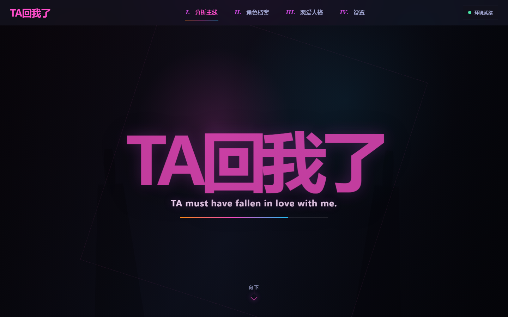
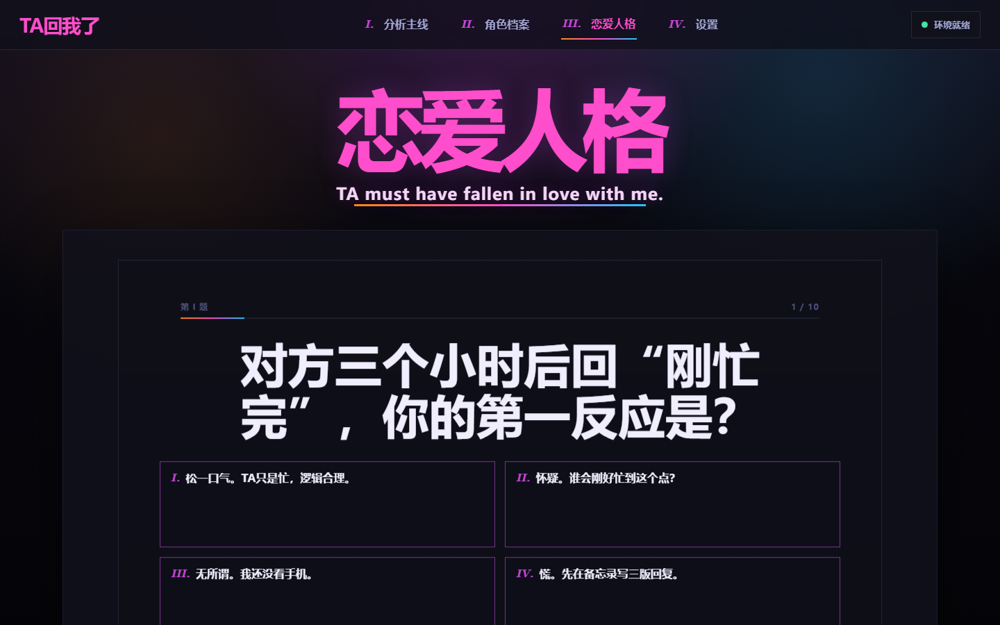
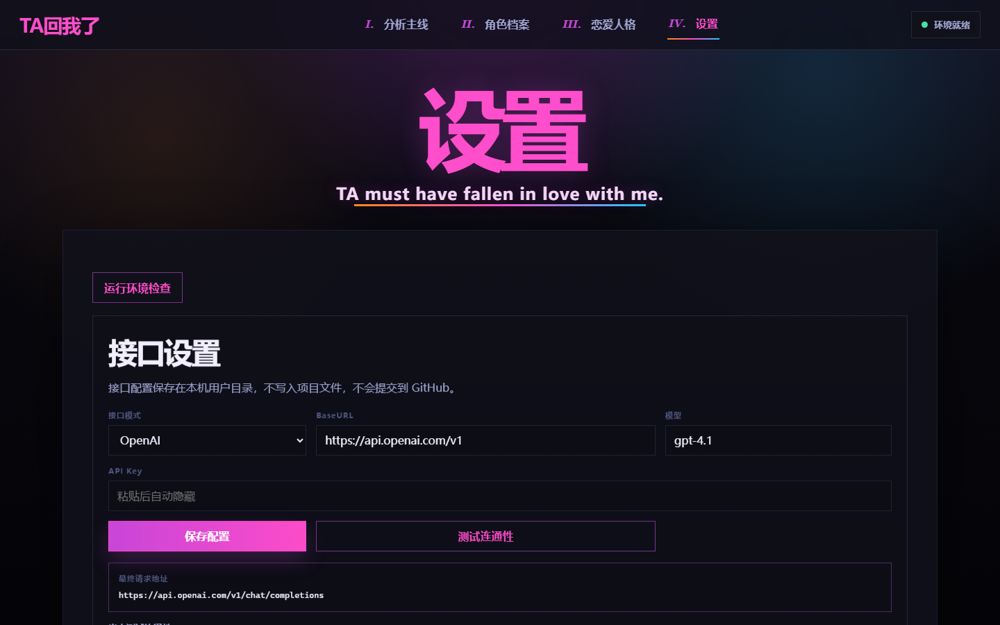

# TA回我了

本地运行的微信聊天恋爱分析工具。它会在你的电脑上读取微信聊天记录，生成互动统计、潜台词分析、角色档案和结果分析报告。

项目默认只在本机运行，不依赖 Codex、Claude Code、Cursor 或任何 Agent 运行时。

> 当前仓库地址：<https://github.com/Exekiel179/she-love-me-web>

## 项目截图








## 功能

- 分析主线：读取微信聊天、选择分析对象、生成结果分析报告。
- 角色档案：保存每次分析记录，后续可以回看或删除。
- 恋爱人格：通过问答生成自己的恋爱沟通倾向。
- 设置：配置模型接口、查看最终请求地址、测试连通性、切换 UI 风格。

## 快速开始

```powershell
python server.py
```

浏览器打开：

```text
http://127.0.0.1:8765
```

首次使用建议先进入「设置」：

1. 选择接口模式。
2. 填写 BaseURL、模型和 API Key。
3. 点击「测试连通性」。
4. 连通成功后回到「分析主线」读取联系人并生成报告。

## 模型接口

设置页支持三种接口模式：

- OpenAI：请求 `/chat/completions`，适合 OpenAI 兼容中转。
- Anthropic：请求 `/messages`，适合 Anthropic 原生接口。
- Gemini：请求 `/models/{model}:generateContent`。

页面会显示“最终请求地址”，用于确认 BaseURL 拼接是否正确。

如果你的中转服务是 OpenAI 兼容接口，即使模型名称是 Claude，也通常应该选择 `OpenAI` 模式。

## 本地配置持久化

模型配置会保存到本机用户目录：

```text
%LOCALAPPDATA%\TAHuiwole\config.json
```

保存内容包括接口模式、BaseURL、模型和 API Key。这个文件不在项目目录里，也不会提交到 GitHub。

也可以用环境变量覆盖配置：

```powershell
$env:SHE_LOVE_ME_LLM_PROVIDER="openai"
$env:SHE_LOVE_ME_LLM_BASE_URL="https://api.openai.com/v1"
$env:SHE_LOVE_ME_LLM_MODEL="gpt-4.1"
$env:SHE_LOVE_ME_LLM_API_KEY="你的 API Key"
python server.py
```

## 数据位置

运行中产生的数据默认保存在本机：

```text
runtime/she-love-me/data/       聊天记录、统计结果、分析 JSON
runtime/she-love-me/reports/    生成的报告
runtime/she-love-me/archives/   角色档案
```

这些目录已加入 `.gitignore`，不会提交到仓库。

## 注意事项

- Windows 解密微信数据库通常需要管理员权限启动终端和微信。
- 微信需要处于已登录状态。
- 如果启用远程模型分析，聊天片段会发送到你配置的模型服务。
- 大聊天记录可能导致中转服务超时。当前已做输入截断和 504 自动精简重试，后续会继续改成分段摘要流程。见 Issue：<https://github.com/Exekiel179/she-love-me-web/issues/1>

## 开发结构

```text
server.py                       本地 Web/API 服务
web/                            前端界面
web/assets/cursors/             动态鼠标资源
docs/screenshots/               README 截图
runtime/she-love-me/scripts/    微信读取、统计和报告脚本
```
